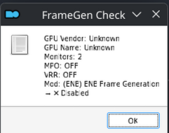

# Wunduniik v6 - Linux Beta Testing Documentation

This document tracks the installation process, issues, and workarounds for testing the beta Wabbajack modpack **Wunduniik v6** on a Linux-based system.

---

## 1. Testing Environment
This section provides an overview of the hardware and software used for this test.

### 1.1. Core Hardware Specifications
*   **CPU:** AMD Ryzen 9 7950X3D (16-Core, 32-Thread)
*   **Graphics Card (Primary):** NVIDIA GeForce RTX 3080 Ti
*   **Memory (RAM):** 64 GB DDR5 @ 6000 MT/s
*   **Storage (Linux):** 1 TB NVMe PCIe SSD (Phison E16 Controller)

### 1.2. Operating System & Drivers
*   **Distribution:** CachyOS (Arch-based Linux)
*   **Kernel Version:** `6.16.0-5-cachyos`
*   **Display Server:** Wayland
*   **Graphics Driver:** NVIDIA Proprietary Driver

---

## 2. Installation & Testing Log
This section details the steps taken during the installation and the outcome of each phase.

### 2.1. Wabbajack & Modlist Installation - ✅ Success (with manual intervention)
*   **Procedure:** Installed the modlist using Wabbajack launched via **Proton 10-10**, following the [Omni-guides method](https://github.com/Omni-guides/Wabbajack-Modlist-Linux/wiki/Wabbajack-via-Proton).
*   **Issue:** Wabbajack failed to download four files (`Synthesis.zip`, and three others from Nexus).
*   **Workaround:** The files were downloaded manually and placed in the `downloads` folder, allowing the installation to proceed.

### 2.2. Post-Installation & MO2 Launch - 🟡 Partial Success
*   **Procedure:** Followed the [omni-guides.sh Automation Script](https://github.com/Omni-guides/Wabbajack-Modlist-Linux/wiki/Using-the-omni%E2%80%90guides.sh-Automation-Script) to automate post-installation tasks.
*   **Issue:** The initial launch attempt triggered a "FrameGen Check" error pop-up (see image below). The second attempt successfully opened Mod Organizer 2 (MO2).
*   **Error Screenshot:**
    

### 2.3. Initial Game Launch Attempt - 🔴 Failure
*   **Action:** Attempted to launch the game using the default Wunduniik executable in MO2.
*   **Issue:** A "core physical optimizer" program would appear, and after it was closed, the game launch process would stop. This failure was repeatable.

### 2.4. Workaround & Expected First-Run Behavior - ✅ Success
A workaround was implemented to initialize the game files, which resulted in the expected behavior for a first-time launch on Linux.
*   **Procedure:**
    1.  Added `SkyrimSELauncher.exe` as a temporary executable in MO2 with settings to create files in a mod folder.
    2.  Ran the launcher once to generate initial files, then closed it.
    3.  Switched back to the primary Wunduniik executable.
*   **Result:** The game launched and then crashed. **This is normal and expected behavior** for the initial run of many complex modpacks on Linux as they finalize their setup. This step is considered a success.

### 2.5. Subsequent Launch Attempts - 🔴 Failure (Wine/Vulkan Crash)
Unlike the expected crash during the initial setup, all subsequent attempts to launch the game resulted in a critical, unexpected runtime error.
*   **Action:** Attempted to launch the game again using the Wunduniik executable in MO2.
*   **Issue:** The game failed to launch and produced a "Wine C++ Runtime Library" error. This is not normal behavior and prevents the game from being played.
*   **Error Details:**
    ```
    Title: Wine C++ Runtime Library
    Message: Assertion failed!
    File: ../src-wine/dlls/winevulkan/loader_thunks.c, Line: 3216
    Expression: !status && "vkCreateGraphicsPipelines"
    ```
*   **Analysis:** This persistent error indicates a fatal crash within Wine's Vulkan implementation, preventing the game from running.
*   **Error Screenshot:**
    
